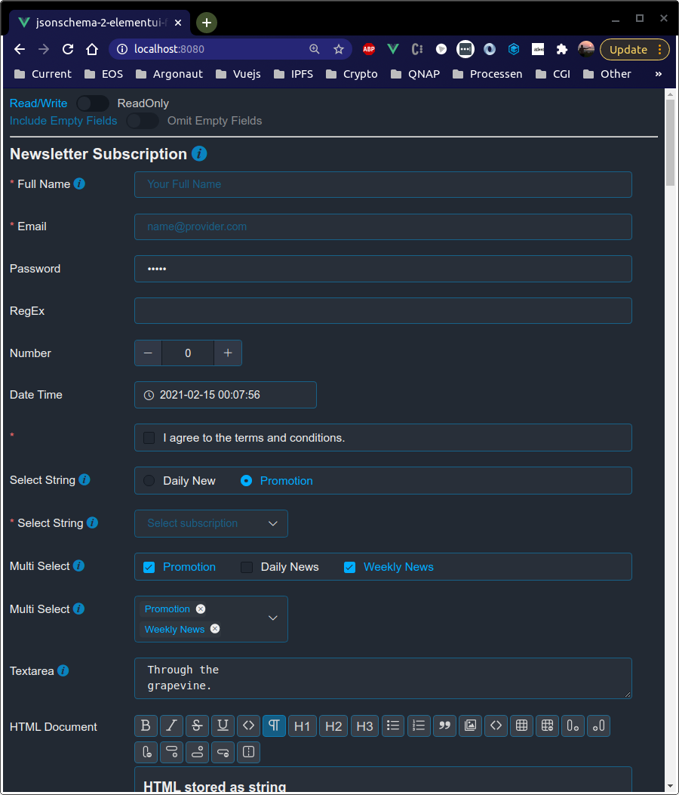
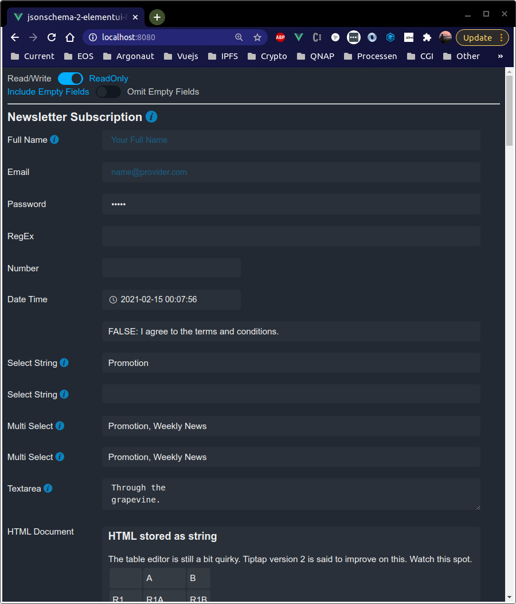
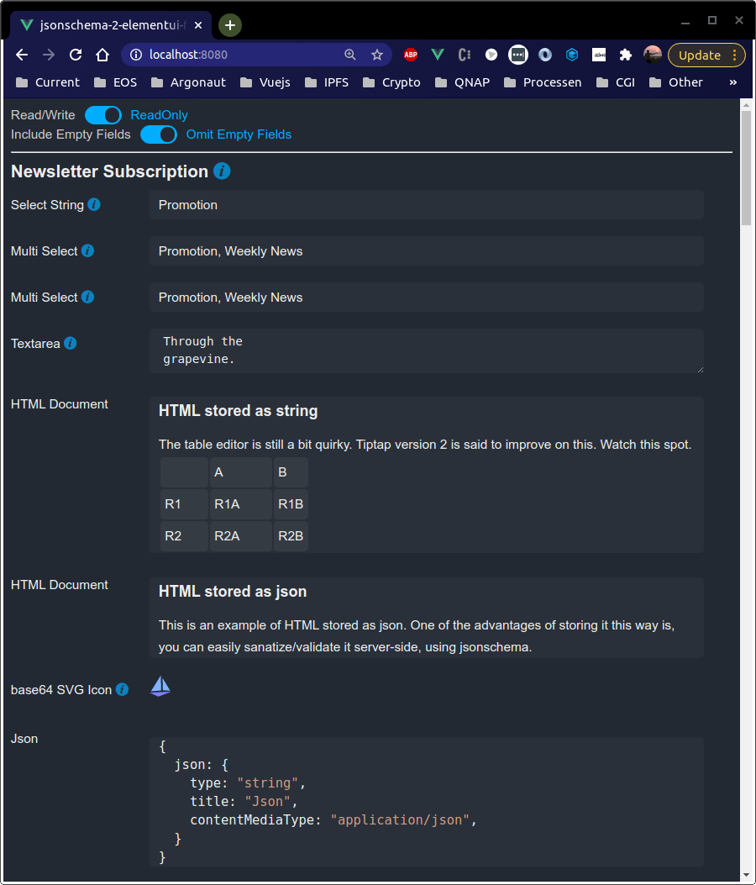

### jsonschema-2-elementui-form
A Vue.js component that takes a jsonschema and generates an element-ui form.

Features:
- Easy to use: just copy JsonSchemaForm.js to your components directory and start using it
- Includes information icons when a description is provided
- Plays nicely with nested objects by recusivly calling itself on the nested object
- Arrays of nested objects can be added, removed or reordered using drag and drop
- Gennerates validation rules for Required, Regex etc.
- All input contols have a readonly version, so that you can use it as a report gennerator
- Optionaly omit empty fields from the form, useful when using it as a report
- Use it to edit base64 SVG icons
- HTML can be stored as string or in json format

Note that in our demo:
- we use the Tiptap editor for HTML and code editing. Tiptap is writen in Vue so it fits in nicely with what we're doing.
- we use highlighter.js for syntax highlighting 
- we've included a dark theme and a bunch of styling

[Live Demo](https://platoscave.github.io/macroeconomy/)

Screenshots:

| Edit Mode   | Readonly Mode | Omit Empty Fields Mode |
| ----------- | ------------- | ---------------------- |
|  |  |  |
